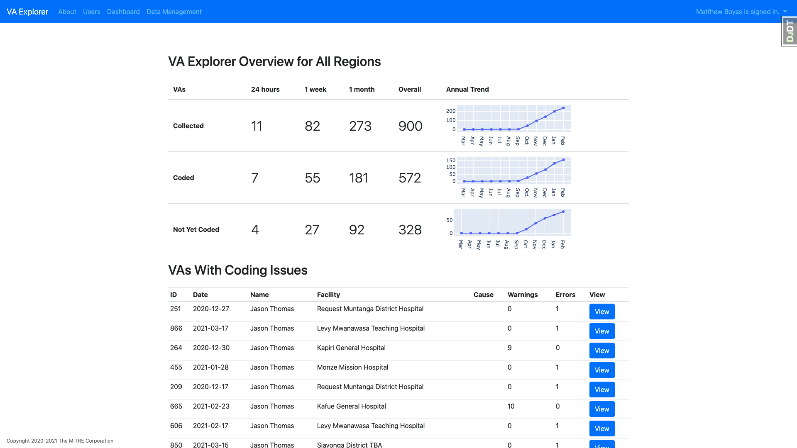
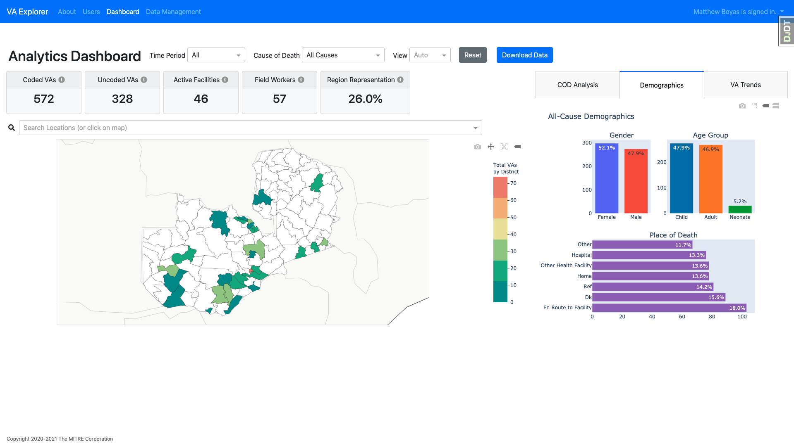
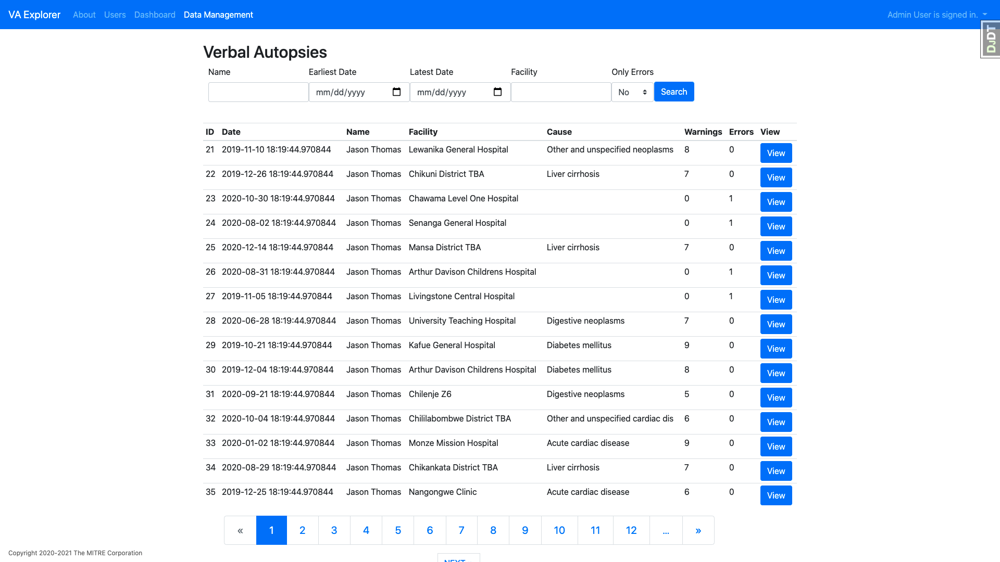

# VA Explorer Web Application Prototype

VA Explorer is a prototype web application, built to both demonstrate verbal
autopsy data management and analysis capabilities and act as a foundation for
exploring new concepts. This prototype represents a work-in-progress, and is
expected to mature in response to feedback from users and subject matter
experts. VA Explorer currently supports the following functionality at various
degrees of maturity:

- User account management, including:
  - Creation/disabling of user accounts by administrators
  - Password management for individual users
  - Supervision of user-submitted VAs such as number submitted/ number of errors
- User access controls, including:
  - Role-based access with the following roles: administrators, data managers,
    data viewers, dashboard viewers, and field workers
  - Assignment to one or more geographic areas for geographical-level scoping
    of data
- Loading of verbal autopsy questionnaire data
- Assignment of cause of death using InterVA5 algorithm (Note: relies on
  external pyCrossVA and InterVA5 services)
- Exploration of cause of death data via a dynamic, visualization-based
  dashboard that includes:
  - A dynamic heatmap showing geographical trends, with zoom capabilities to
    hone in on regions of interest
  - Cause of death plots for chosen regions
  - Death distributions by age, gender, and place of death for chosen regions
  - Trends over time for chosen regions

<a href="docs/assets/overview.png">
  
</a>Î
<a href="docs/assets/dashboard.png">
  
</a>
<a href="docs/assets/vas.png">
  
</a>Î

## Background

Verbal autopsies (VAs) are structured interviews for determining the most
likely cause of death based on information from caregivers or family members
about the signs and symptoms the deceased experienced before they died. The
current VA IT landscape consists of tools and systems that together enable the
various steps of the VA process, from generation and revision of a VA interview
questionnaire to the eventual use of the resulting cause of death data by
localities. By directly integrating with existing functionality, drawing
inspiration from others, and combining new features into a cohesive whole, VA
Explorer aims to enable the integration of verbal autopsy into civil
registration and vital statistics systems at scale.

## Installation and Setup for Development or Testing

VA Explorer is a Django web application that uses the PostgreSQL database for
data storage.

### Prerequisites

To work with the application, you will need to install some prerequisites:

- [Python 3](https://www.python.org/downloads/)
- [pip](https://pypi.org/project/pip/)
- [Postgres](http://www.postgresql.org/)
- [Docker](https://www.docker.com/)

_Note:_ If this is your first time using Postgres, you may be requested to
create a user and password for the first time during setup. Take note of this
user and password as it will be used later for our setup, as well as your future
other projects setups. Instructions can be found online to change your postgres
user's password.

Once the prerequisites are available, VA Explorer can be installed and
demonstration data can be loaded.

### Setup

- Retrieve the application source code

  `git clone https://github.com/VA-Explorer/va_explorer.git`

- Change into the new directory

  `cd va_explorer`

- Create a virtual env

  `python -m venv venv`

- Activate the virtual env:

  Mac: `source venv/bin/activate`
  Windows: `python -m venv /venv/bin/activate`

- Install application and local development requirements

  `pip install -r requirements/dev.txt`

- Windows only: manually uninstall and reinstall `psycopg2`

  `pip uninstall psycopg2; pip install psycopg2`

- Create the va_explorer database using your postgres user made during postgres
  download. It may be `postgres` for example.

      `createdb va_explorer -U <name of Postgres user> --password`

- Create a .env file at the project root with the following key/value pairs:

  - `DATABASE_URL=psql://<YOUR POSTGRESUSER>:<POSTGRESUSER PASSWORD>@localhost/va_explorer`
  - `CELERY_BROKER_URL=redis://localhost:6379/0`

- Run the database migrations
  - `./manage.py makemigrations`
  - `./manage.py migrate`

### Tasks

- Manage user accounts

  - Create user roles

    `./manage.py initialize_groups`

  - Create an administrator user for the local environment (note that for the
    production environment instead of providing the password on the command line a
    system-assigned, randomly-generated password will be printed to the console)

    `./manage.py seed_admin_user <EMAIL_ADDRESS> --password <PASSWORD>`

  - Create demonstration accounts for data manager, data viewer, and field
    worker. This task only works in the local environment and is for demonstration
    purposes, only.

    `./manage.py seed_demo_users`

  - Bulk-create users from a csv file.

    `./manage.py bulk_load_users <CSV_FILE> --email_confirmation <True/False>`

    You can specify user emails, roles, location restrictions, and any other
    restrictions that are currently exposed in the User Creation Form. If
    `--email_confirmation` is set to `True`, a confirmation email will be sent
    out to each new user. Otherwise, their credentials (with temporary password)
    will be printed to the console. To get a starting template for user csv
    file, you can run the following command:

    `./manage.py get_user_form_template --output_file <FILENAME>`

  - Export anonymous info for all users in system

    `./manage.py export_user_info --output_file <FILENAME> --user_file=<FILENAME>`

    This will export anonymous user IDs, user roles, geographic restrictions
    and privileges to a `.csv` file. Ultimately, the file can be used to track
    user activity in logs without compromising their PII. By default, it
    exports info on all users in the system, but you can choose to filter down
    to a select list of users by setting the `--user_file` argument to a
    `.txt` file with all user emails (one per line) you'd like to know about.
    In this case, the command will tell you which emails failed to match users
    in the database.

- Link Field Workers to VAs

  `./manage.py link_fieldworkers_to_vas --emails <comma-separated field worker emails> --match_threshold <1-100> --debug <True/False>`

  This command links a group of field workers to their corresponding VAs in
  the system. Linking is done by searching a VA's interviewer name (field
  `Id10010`) against names of field workers in the system. If there's a match,
  a link is created by setting the VA's username to the matching field
  worker's username. By default, all field workers in the system are considered
  for matching, but you can specify a subset with the `--emails` argument
  (comma-separated, no spaces). To account for typos and slight variations in
  name spelling, a fuzzy-matching algorithm is used. You can specify how
  stringent the algorithm is with `--matching_threshold` (higher is stricter,
  with 100 being a perfect match).

- Load location data

  `./manage.py load_locations <NAME OF CSV>`

- Load verbal autopsy questionnaire data

  `./manage.py load_va_csv <NAME OF CSV>`

- Start the cause of death coding microservices (pyCrossVA for format
  translation and InterVA5 for coding); note that these are services
  that should be left running during development activities, which can
  be accomplished using a separate terminal or the -d flag. (See
  [Building/Running in Docker](#buildingrunning-in-docker) for more details).

  `docker-compose up --build`

- Run the InterVA5 cause of death coding algorithm (See
  [Running Coding Algorithm](#running-coding-algorithm) for more details).

  `./manage.py run_coding_algorithms`

- Run the tests

  `pytest`

### Running the Application

- Run the application server

  `./manage.py runserver 0.0.0.0:8000`

The server will be running at <http://0.0.0.0:8000/>

## Building/Running in Docker

Django can run locally inside Docker. Doing so will also set up postgres and redis and automatically configure `DATABASE_URL` and `CELERY_BROKER_URL` to use the docker images of postgres and redis.

First, create a sharable network for VA Explorer: 
```
docker network create va-net
```

Next, if you have other docker-compose apps such as ODK Central that need to
communicate with VA Explorer, you will need to update each app's `docker-compose.yml` to enable network sharing:
```yml
networks:
  default:
    external:
      name: va-net
```

Finally, build and deploy VA Explorer by running the following:
```
docker-compose -f docker-compose.prod.yml -f docker-compose.local.yml up django vapostgres
```

The server will be running at <http://0.0.0.0:5000/>


### Building for Production

To build a production ready version of all images, run the following:

```
docker-compose build
```

This will build the following docker images:

```
va_explorer/pycrossva
va_explorer/interva5
va_explorer/vapostgres
va_explorer/celeryworker
va_explorer/celerybeat
va_explorer/flower
va_explorer/django
```

### Deploying with a reverse proxy

Set the following environment variables to an appropriate place for the
host such as `/etc/env` or preferred location.

```
export EMAIL_URL=smtp://localhost:25 <or> consolemail://
export CELERY_BROKER_URL=redis://redis:6379/0
export REDIS_URL=redis://redis:6379/0
export POSTGRES_HOST=vapostgres
export POSTGRES_PORT=5432
export POSTGRES_DB=va_explorer
export POSTGRES_USER=postgres
export POSTGRES_PASSWORD=Pimin73y!we
export DJANGO_SECRET_KEY=something-secret
export DJANGO_ALLOWED_HOSTS=localhost
```

Run docker-compose in daemon mode:

```
docker-compose up -d django
```

If using Apache, ensure the following modules are enabled:

- proxy proxy_http proxy_wstunnel
- headers rewrite
- ssl
- deflate
  and set the following configuration in your apache configuration:

```
LoadModule rewrite_module modules/mod_rewrite.so
LoadModule proxy_module modules/mod_proxy.so
LoadModule proxy_http_module modules/mod_proxy_http.so
LoadModule proxy_wstunnel_module modules/mod_proxy_wstunnel.so

<VirtualHost *:80>
        ServerAdmin verbal-autopsy@mitre.org
        ServerName va-explorer.mitre.org
        ServerAlias www.va-explorer.mitre.org

        Redirect permanent / https://va-explorer.mitre.org

        ErrorLog ${APACHE_LOG_DIR}/va_error.log
        CustomLog ${APACHE_LOG_DIR}/va_access.log combined
</VirtualHost>

<IfModule mod_ssl.c>
  <VirtualHost _default_:443>
        SSLEngine on
        ServerAdmin verbal-autopsy@mitre.org
        ServerName va-explorer.mitre.org
        ServerAlias www.va-explorer.mitre.org

        AddOutputFilterByType DEFLATE text/plain text/html text/css \
        text/javascript application/javascript application/json text/csv \
        application/vnd.ms-excel application/vnd.openxmlformats-officedocument.spreadsheetml.sheet

        <Location />
                ProxyPreserveHost on
                ProxyPass http://localhost:5000/
                ProxyPassReverse http://localhost:5000/

                SetOutputFilter INFLATE;DEFLATE

                RewriteEngine on
                RewriteCond %{HTTP:UPGRADE} ^WebSocket$ [NC]
                RewriteCond %{HTTP:CONNECTION} ^Upgrade$ [NC]
                RewriteRule .* ws://localhost:5000%{REQUEST_URI} [P]
        </Location>

        SSLCertificateFile /etc/ssl/certs/va-explorer.pem
        SSLCertificateKeyFile /etc/ssl/private/va-explorer.key

        ErrorLog ${APACHE_LOG_DIR}/va_error.log
        CustomLog ${APACHE_LOG_DIR}/va_access.log combined
  </VirtualHost>
</IfModule>
```

### Creating first user

To create a super user while running under Docker, make sure the container is
running, then run the following command to enter a shell in the docker container

```
docker-compose exec django sh
```

From there, you can create a super user. Follow the prompts after running this
command:

```
./manage.py createsuperuser
```

## Running Coding Algorithm

There are two ways to run the coding algorithm to add cause of death to uncoded
verbal autopsies: from the command line or from the user interface. The system
currently supports InterVA5 and its associated settings but will eventually
expand to others such as InSilicoVA.

Both methods require the `PYCROSS_HOST` and `INTERVA_HOST` environment variables
to be configured to point to the locations of pyCrossVA and InterVA5
respectively. If you are in Docker, both of those will have been configured and
started up automatically.

### Command Line

From the command line, you can run the following to run coding algorithms:

```
./manage.py run_coding_algorithms
```

This will list a brief report of results in the following format:

```
Coded 24 verbal autopsies (out of 30) [6 issues]
```

If you'd like to re-code all existing VAs in the system (overwriting previous
COD assignments) you can do so by passing `overwrite True` to the command-line
call. This will save a backup table of old COD assignments, clear all CODs in
the database, and re-run the coding algorithm on all eligible VAs. By default,
old COD assignments will be saved to a .csv file named `old_cod_mapping.csv`.
You can customize the name of this file by passing `--cod_fname <filename>` as
an optional parameter.

You can also configure certain algorithm settings as environmental variables.
For InterVA5, you can set HIV prevalence `(very low (v), low (l) or high (h))`,
Malaria prevalence (same options as HIV), and whether or not to export group
codes to COD assignments `(True/False)` in your `.env` file like so:

```
INTERVA_MALARIA=l
INTERVA_HIV=v
INTERVA_GROUPCODE=False
```

See `va_data_management/utils/coding.py` for more details

**Note**: You will receive an error message if pyCrossVA or InterVA5 are
unavailable.

### User Interface

Users with permissions to modify verbal autopsy records will see a "Run Coding
Algorithms" button on the home page of the application.

In addition to pyCrossVA and InterVA5, this functionality requires that Celery
is running and the `CELERY_BROKER_URL` and `REDIS_URL` environment variables
have been configured properly. If you are running in Docker, Celery will have
been configured and started up automatically.

Clicking the "Run Coding Algorithms" will execute the coding algorithms in the
background using Celery. You will not receive an error on the user interface if
the process is not successful. To check for errors, you will need to view the
Celery logs.

## Importing From ODK

You can use the `import_from_odk` management command to import records from an
ODK server like so. You must specify either project-name or project-id and
form-name or form-id to import:

```
./manage.py import_from_odk --project-id=1234 --form-id=va_form_id
# or
./manage.py import_from_odk --project-name=zambia-test --form_id=va_form_id
# or
./manage.py import_from_odk --project-name=zambia-test --form_name='Form Name'
```

This depends on the following environment variables being set:

```
ODK_HOST=https://odk-server
ODK_EMAIL=example@example.com
ODK_PASSWORD=example
```

Alternatively, you can specify email and password as command line arguments:

```
./manage.py import_from_odk --project-name=zambia-test --email=example@example.com --password=example
```

## Auto-detecting Duplicates

VA Explorer can be optionally configured to auto-detect duplicate Verbal
Autopsies and surface potential duplicates in the user interface. By default,
this feature is turned off.

To use this feature, identify a subset of key Verbal Autopsy fields that will,
in concert, uniquely identify a Verbal Autopsy. The fields are passed into the
application as an environment variable:

```
QUESTIONS_TO_AUTODETECT_DUPLICATES="question1, question2, question3"
```

As per above, the value for this variable must be a comma-separated string. If
any Verbal Autopsies match across these fields, they will be marked as potential
duplicates. The oldest Verbal Autopsy (by created timestamp) amongst a set of
matching Verbal Autopsies is designated as the non-duplicate.

### Marking Existing VAs as Duplicate

To mark existing Verbal Autopsies in the database as potential duplicates, you
may use the following command:

```
./manage.py mark_vas_as_duplicate
```

This command should be run prior to using the feature in the user interface to
avoid unexpected results.

IMPORTANT NOTE: If the value of `QUESTIONS_TO_AUTODETECT_DUPLICATES` is changed,
you must re-run the command

```
./manage.py mark_vas_as_duplicate
```

### Managing Duplicate VAs

Duplicate Verbal Autopsies will appear in the user interface under the "Data
Cleanup" tab. The Data Cleanup tab is only present when the environment variable
`QUESTIONS_TO_AUTODETECT_DUPLICATE` is set. To manage duplicates, you may delete
them or edit the possible duplicate Verbal Autopsies to remove them from
detection.

## Adding Icons
VA Explorer uses fontello for application icons rather than a full icon library so that only the icons 
used in the application are loaded. By only including icons that are used in the application, page load 
performance is improved. 

To use fontello icons:
1. Visit https://fontello.com/
2. Select icons through the user interface
3. Click 'Download webfont' button
4. Unzip the downloaded folder
5. Replace the current folder at `va_explorer/static/vendor/fontello-<hash>` with the newly-downloaded folder 
6. Update the application's base template, base.html, to reference the new folder

## Troubleshooting

- If experiencing trouble installing the `pyscopg2` application requirement, it
is possible that `pyscopg2` may be pointing to the wrong SSL when trying to
download. Temporarily adding this environment variable has worked as a fix.

```
export LDFLAGS='-L/usr/local/lib -L/usr/local/opt/openssl/lib -L/usr/local/opt/readline/lib'
```

- If experiencing trouble installing `scipy` application requirement,
specifically with this error message:
```
numpy.distutils.system_info.NotFoundError: No lapack/blas resources found. Note: Accelerate is no longer supported. 
----------------------------------------
ERROR: Command errored out with exit status 1
```
[This thread](https://github.com/scipy/scipy/issues/13102#issuecomment-962468269)
can be helpful. Please make sure to upgrade pip, such as by running the command
`pip install --upgrade pip`. This issue has especially come up for users on
MacOS Big Sur users.

## Version History

This project adheres to [Semantic Versioning](http://semver.org/).

Releases are documented in the [CHANGELOG]().

## License

Copyright 2020-2022 The MITRE Corporation

The source of this information is the Data for Health Initiative, a joint
project of the CDC Foundation and Bloomberg Philanthropies.

VA Explorer is available under the
[Apache License, Version 2.0](https://opensource.org/licenses/Apache-2.0). VA
Explorer also included external software that is available under a variety of
licenses. See [LICENSE](./LICENSE) for full license text(s).

Unless required by applicable law or agreed to in writing, software distributed
under the License is distributed on an "AS IS" BASIS, WITHOUT WARRANTIES OR
CONDITIONS OF ANY KIND, either express or implied. See the License for the
specific language governing permissions and limitations under the License.

## Contact Information

For questions or comments about VA Explorer, please send an email to:

```
verbal-autopsy@mitre.org
```
