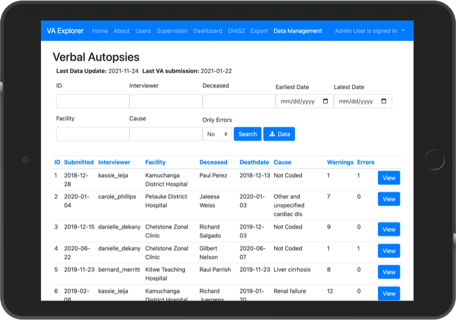

#  VA Explorer

[](https://github.com/VA-Explorer/va_explorer/blob/main/docker-compose.yml)
[](https://github.com/VA-Explorer/va_explorer/actions?query=branch%3Amain)

VA Explorer is full service verbal autopsy (VA) management reference implementation.
It demos VA data management and analysis capabilities while exploring IT challenges
in the VA domain. This reference implementation represents a work-in-progress,
maturing in response to feedback from users and subject matter experts like in our
Zambia pilot program. VA Explorer currently supports the following features:

- User account management and role-based access
- Supervision of users' and facilities' incoming data
- Automatic cause of death assignment via algorithms like InterVA5
- Visualization and analysis dashboard with geography, demographics, trends, etc.
- Ability to detect and correct errors in collected VAs
- Import of VA data and export of processed VA data
- Integrations other tools in the domain such as ODK Central and DHIS2

for more details, see [VA Explorer's Features](https://va-explorer.github.io/va_explorer/usage/features.html)


</br>


## Background

VAs are [a standard WHO instrument](https://www.who.int/standards/classifications/other-classifications/verbal-autopsy-standards-ascertaining-and-attributing-causes-of-death-tool)
in the form of a structured interview for determining the most likely cause of
death based on interview answers. VA Explorer aims to help users of VAs, typically
those involved with civil registration and vital statistics, process, manage, and
analyze their collected data by integrating other VA IT tools and functionalities
behind a single, scalable, common interface.

## Deploy Your Own

VA Explorer instances are easily deployed via docker-compose and web server.
[Read the guide](https://va-explorer.github.io/va_explorer/usage/getting_started/)
to learn how to run VA Explorer for yourself or your organization.

## Getting Started

Full documentation and training on how to install, configure, deploy and use VA
Explorer is available at [va-explorer.github.io/va_explorer](https://va-explorer.github.io/va_explorer)

The rest of this README focuses on a quick start for _**contributors**_. If that
applies, thank you. Your contributions are welcome and hugely appreciated. Read
on to get started.

### Pre-requisites

VA Explorer is built with Django, backed by Postgres, and packaged with Docker so
contributors should install:

- [Python 3](https://www.python.org/downloads/)
- [Postgres](http://www.postgresql.org/)
- [Docker](https://www.docker.com/)

### Setup

1. Clone this repo and change into the new directory

```shell
git clone https://github.com/VA-Explorer/va_explorer.git && cd va_explorer
```

2. Create a project virtual env and activate it

```shell
python -m venv venv && source venv/bin/activate
```

3. Install app dependencies and local dev dependencies

```shell
pip install -r requirements/base.txt
```

4. Create a database and local .env config for va_explorer (edit .env if needed)

```shell
createdb va_explorer -U postgres && cp .env.template .env
```

5. Run va_explorer database migrations

```shell
./manage.py makemigrations && ./manage.py migrate
```

6. Initialize user permissions and create an admin to login with

```shell
./manage.py initialize_groups && ./manage.py seed_admin_user <EMAIL_ADDRESS> --password
```

Next, depending on the area of VA Explorer being contributed to there are a variety
of management commands available to import data, seed demo users, load locations,
and more. See:

- [Admin Commands](https://va-explorer.github.io/va_explorer/training/admin_guides.html#management-commands)
- [Development Commands](https://va-explorer.github.io/va_explorer/development.html#development-commands)

## Running & Testing

After setup, contributors should be able to run VA Explorer locally:

```shell
./manage.py runserver 0.0.0.0:8000
```

and access the interface by navigating to `localhost:8000` in their browsers.
Similarly, contributors should be able to lint (via pre-commit/ ruff) and test
(via pytest) contributions like so:

```shell
pre-commit install && pre-commit run --all-files
```

```shell
pytest
```

Coverage reporting is also available via:

```shell
coverage run -m pytest && coverage report
```

configuration for these tools is provided by `pyproject.toml`

Contributors using the automatic cause of death assignment feature can do so by
building the required docker services and running that management command:

```shell
docker-compose up --build && ./manage.py run_coding_algorithms
```

further documentation on development, including troubleshooting of common issues
is available on the [documentation website](https://va-explorer.github.io/va_explorer)
and good first issues are actively tagged by current contributors
[here](https://va-explorer.github.io/va_explorer)

Thanks again, whether through suggestions/ issues, or code, it's deeply appreciated!

## License

Copyright © 2020-2023, The MITRE Corporation. Licensed under Apache 2.0

The source of this information is the Data for Health Initiative, a joint
project of the CDC Foundation and Bloomberg Philanthropies.

Available publicly via [Apache License, Version 2.0](https://opensource.org/licenses/Apache-2.0).
VA Explorer also includes external software that is available under a variety of
licenses. See [LICENSE](./LICENSE) for full license text(s).

Unless required by applicable law or agreed to in writing, software distributed
under the License is distributed on an "AS IS" BASIS, WITHOUT WARRANTIES OR
CONDITIONS OF ANY KIND, either express or implied. See the License for the
specific language governing permissions and limitations under the License.

Contact `verbal-autopsy@mitre.org` with any questions or comments.
